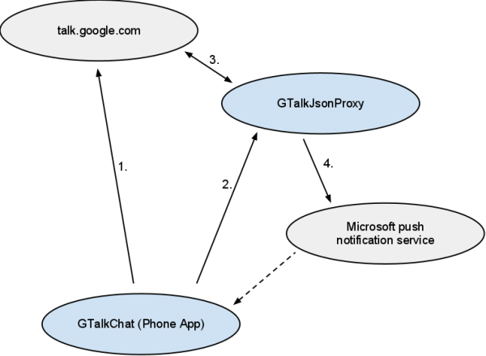

GTalkJsonProxy is released under the terms of the [CC BY-NC-SA license][1].

# What is it?

This is the JSON proxy used by the [Gchat][2] app to talk to the GoogleTalk IM
service. Its client API is JSON over HTTP, which is translates into XMPP to
send to Google. Crucially, the connection is maintained on the server side and
messages are sent to the phone app using Microsoft's push notification server.

Although it's currently tightly bound to Microsoft's push notification system,
this server could be adapted to run battery-friendly IM clients on iOS or
Android. Likewise, the GoogleTalk specific stuff can be stripped out to make a
generic XMPP proxy.

# How does it work?

There are four components involved in making Gchat work: this proxy, Google's
servers, Microsoft's push notification service and the Windows Phone app
itself. The connections and direction of communication (initiation) are shown
below:

When the user issues the login command from the phone app, the credentials are
authenticated directly with Google (1). After successful authentication, the
client connects to the proxy (2) and invokes `/login`, passing the session
token to the proxy. 

The proxy connects to Google's servers using the session token handed by the
client (3). Incoming server notifications are forwarded to the phone via the
push notification service.

It's important to note that the proxy is never shown the username and password
to the client's Google account. The proxy keeps all client data (such as the
auth token) encrypted in a redis store.

The "Background Information" section of this document contains links to further
information on the GoogleTalk protocol and the push notification server.

# How can I hack it?

## Prerequisites:

* node
* npm
* redis

## Install dependencies:

    npm install base64
    npm install xml2js
    npm install gzip
    npm install redis

If you get an error message saying that the `base64` module cannot be found,
copy the `base64.node` file from `node_modules/base64/build/Release` to
`node_modules/base64`.

## Generate certificates

Generate the server key and certificate, self-sign the latter, then remove the
passphrase from the former. This is the certificate presented to connecting
clients. Its cn should match your host name.

    openssl genrsa -aes256 -out server.key-pass 1024
    openssl req -new -key server.key-pass -out server.csr
    openssl x509 -req -days 365 -in server.csr -signkey server.key-pass -out server.crt
    openssl rsa -in server.key-pass -out server.key
    rm server.csr 

Repeat the above for the client key and certificate. These identify the
GTalkJsonProxy to Microsoft's Push Notification Server. 

    openssl genrsa -aes256 -out client.key-pass 1024
    openssl req -new -key client.key-pass -out client.csr
    openssl x509 -req -days 365 -in client.csr -signkey client.key-pass -out client.crt
    openssl rsa -in client.key-pass -out client.key
    rm client.csr 

Finally, generate a key used to encrypting the stuff that gets stored in redis.

    openssl genrsa -aes256 -out crypto.key-pass 1024
    openssl rsa -in crypto.key-pass -out crypto.key

## Create an unprivileged user to run the server

    useradd -M -d $PWD gtalk

# Running the server

Start redis, run `sudo node service.js`. The server binds to port 443, then
drops superuser privs.

# Testing the server

You may want to set the logging level to TRACE at the top of `service.js`.

Autheticate with Google, dig up your auth token. Use your requests library of
choice to fire an HTTP POST at `/login` with `username` and `auth` parameters
as post data.

Keep firing POST requests at the URL. There's currently no protocol
specification, but the protocol can be distilled from [GoogleTalk.cs][3] in the
client project.

You may want to install the [Windows Phone SDK][7] and make your own build of
the client app. Yep, it's Windows only.

# Background information

* [GoogleTalk developer documentation][4]
* [XMPP Protocol specs][5]
* [Microsoft Push Notification Server][6]

  [1]: http://creativecommons.org/licenses/by-nc-sa/3.0/
  [2]: https://github.com/lhchavez/gtalkchat/
  [3]: https://github.com/lhchavez/gtalkchat/blob/master/Gchat/Protocol/GoogleTalk.cs
  [4]: http://code.google.com/apis/talk/talk_developers_home.html
  [5]: http://xmpp.org/xmpp-protocols/rfcs/
  [6]: http://msdn.microsoft.com/en-us/library/hh202945%28v=VS.92%29.aspx
  [7]: http://www.microsoft.com/visualstudio/en-us/products/2010-editions/windows-phone-developer-tools

